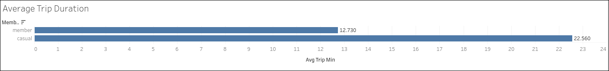
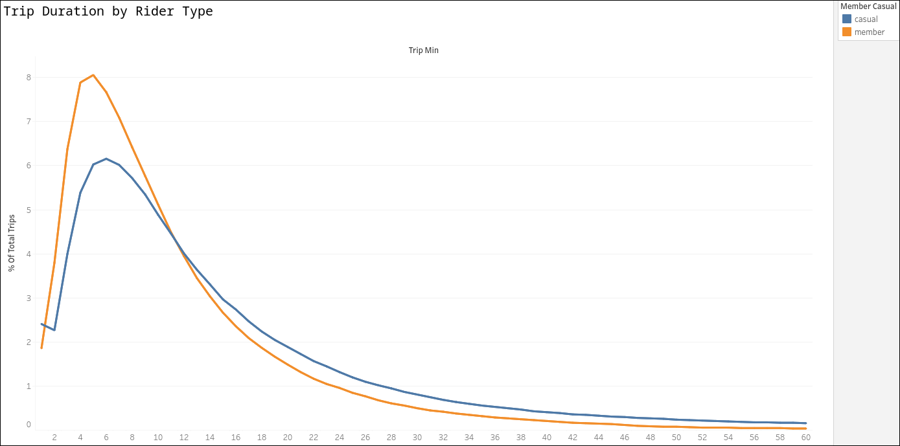
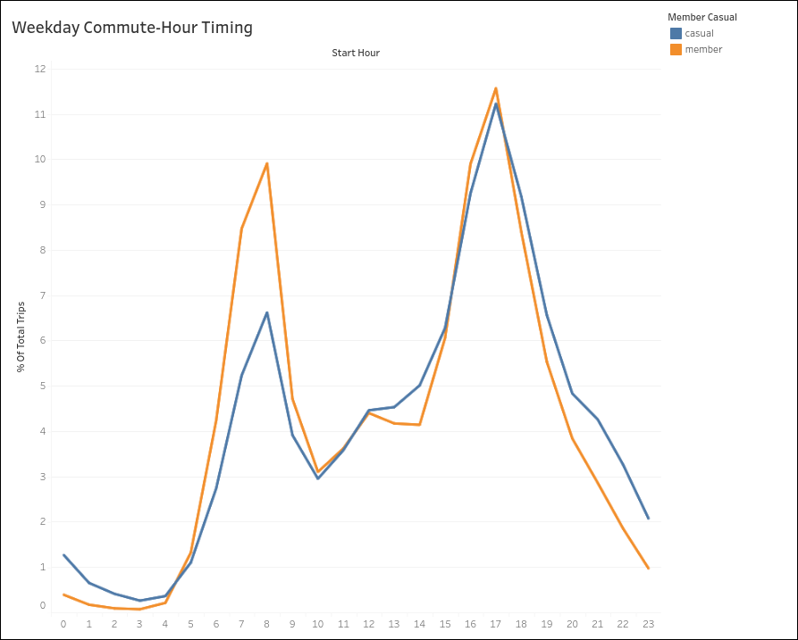
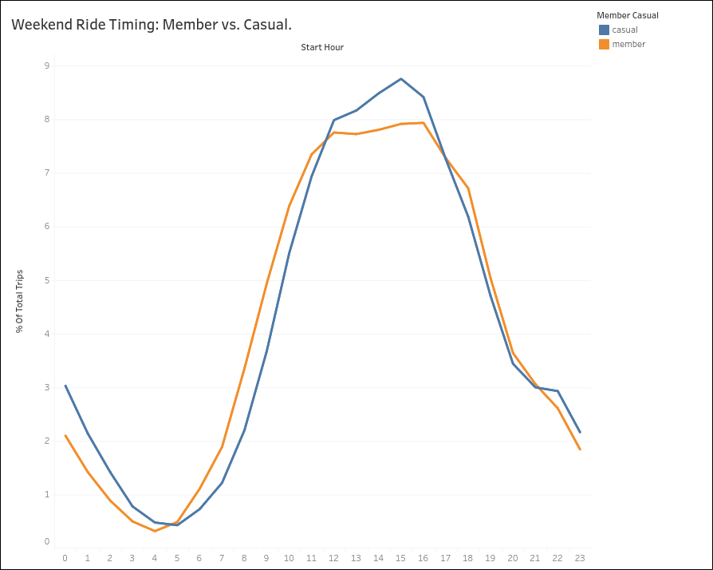
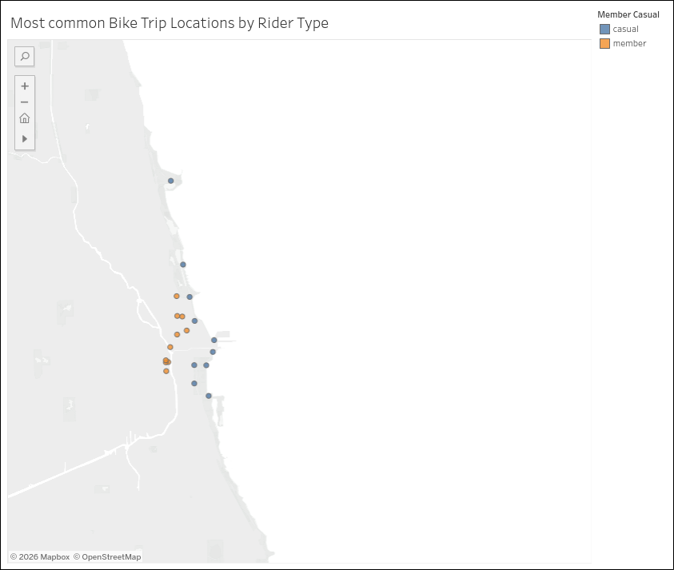

# CaseStudy_bike-share
 
Analysis of Cyclistic's highest-value, casual to member conversion opportunities in 5.9M bike-share trips. A Google Data Analytics capstone project, completed with SQL and Tableau
 
## Slide show version
*will be added shortly*
- Web link: —
- Download: —
  
## Cyclistic Case Study
- Data from: Coursera | Google Data Analytics Capstone
- Project completed by: Thomas D Cochran
 
## Business task
Learn how annual members and casual riders use Cyclistic bikes differently, from the perspective of designing a new marketing strategy to convert casual riders into annual members.
 
## Top 3 recommendations
 
1. **Target the commuter segment** — discounted first-month membership for casual riders with short, weekday rush-hour, point A to point B trips. This group already rides like a member, with an 89.74% hour of day pattern match between the member and casual riders.
   
2. **Weekend/leisure tier** — casual and member weekend ride timing overlap 94.08%. A leisure riders offer (weekend-unlimited ?) targets a large group of people with the reason why they ride
   
3. **Hotspot-targeted marketing** — member and casual riders' top-10 busiest stations show *zero* overlap. Members cluster around downtown business intersections, while casual riders cluster around lakefront landmarks. In-person offers, like QR codes or geofenced push notifications, placed at casual riders' top stations reach 45% of casual ridership. a more efficient conversion target than marketing at member's own hotspots.
   
## Evidence
 
**Trip duration**
Members ride shorter on average than casual riders (~12.7 min vs. ~22.6 min).
 

 
**Weekday commute pattern**
Isolating short (≤15 min), point-to-point trips on Tue/Wed/Thu rush hours, casual riders' hour-of-day timing shows an 89.74% shape match with confirmed member commuters.

 
**Weekend timing**
Casual and member riders overlap 94.08% in when they ride on weekends.

 
 
**Station geography**
Casual trip share tracks 2–3 percentage points behind member trip share across every station-popularity tier tested (top 5 through top 500) — but the top-10 stations for each group show zero overlap.
 

 

## Data Cleaning
*will be added shortly*

